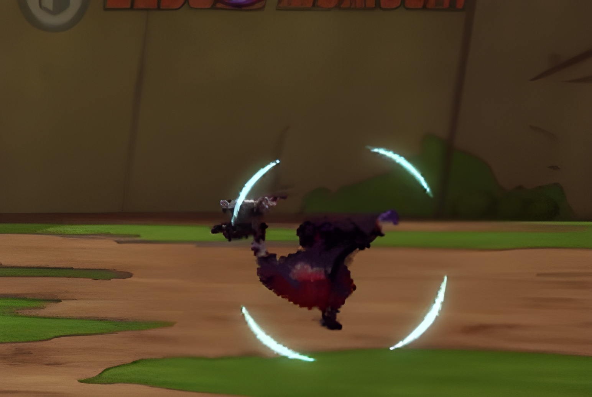
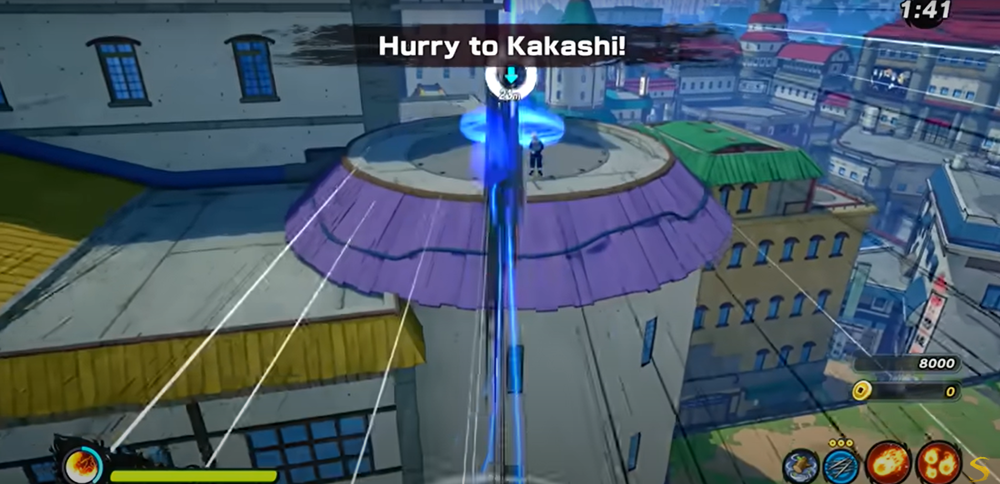

# Système de Combat

## Sommaire
1. [Verrouillage d'un adversaire ("Lock")](#verrouillage-dun-adversaire-lock)
2. [Attaques ciblées lors du verrouillage](#attaques-ciblées-lors-du-verrouillage)
3. [Distance et fluidité](#distance-et-fluidité)
4. [Objectifs clés](#objectifs-clés)
5. [Références et illustrations](#références-et-illustrations)

---

## 1. Verrouillage d'un adversaire ("Lock")

### Activation du verrouillage
- **Touche dédiée** : Une touche (exemple : `E` ou `F` [USE KEY]).
- **Conditions nécessaires** :
  - L'adversaire doit :
    - Être **dans le champ de vision du joueur**.
    - Être à une **distance inférieure ou égale à une valeur déterminée** (`X`).
  - Une **marge d'erreur** est tolérée pour simplifier le verrouillage : 
    - Le système verrouille l’ennemi le plus proche de la ligne de visée.
- **Indicateur visuel** :
  - Un effet visuel léger (exemple : cercle, lueur, ou flèche) indique l'adversaire verrouillé.

### Perte du verrouillage
- Le verrouillage est rompu si :
  - L’adversaire sort **complètement du champ de vision**.
  - Un **obstacle important** bloque la ligne de visée.
- Dans ces cas, le joueur doit relocker manuellement.

[Retour au sommaire](#sommaire)

---

## 2. Attaques ciblées lors du verrouillage

- Lorsqu'un adversaire est verrouillé :
  - Les attaques sont **automatiquement dirigées** vers cet adversaire.
  - En cas d'attaque de corps à corps :
    - Le joueur est **propulsé automatiquement** vers l'adversaire pour engager l'attaque.
    - La trajectoire suit dynamiquement les mouvements de l'adversaire.

[Retour au sommaire](#sommaire)

---

## 3. Distance et fluidité

### Ajustement dynamique
- Si l’adversaire verrouillé s’éloigne légèrement de la portée (`X`), le joueur effectue un dash ou une téléportation pour maintenir le combat.
- Si la distance devient trop importante, une **animation visuelle subtile** indique la rupture.

[Retour au sommaire](#sommaire)

---

## 4. Objectifs clés

- **Fluidité** : Des déplacements et attaques naturels et rapides.
- **Dynamisme** : Capacité d'engager rapidement des combats.
- **Accessibilité** : Le verrouillage est simple grâce à une marge d’erreur tolérée.

[Retour au sommaire](#sommaire)

---

## 5. Références et illustrations

- Exemple de verrouillage :

- Illustration d’un système de dash dynamique :

---

### Références croisée

- Pour le système de sélection des ninjutsus, consultez [Sélection des ninjutsus](SELECTION.md).

[Retour au sommaire](#sommaire)